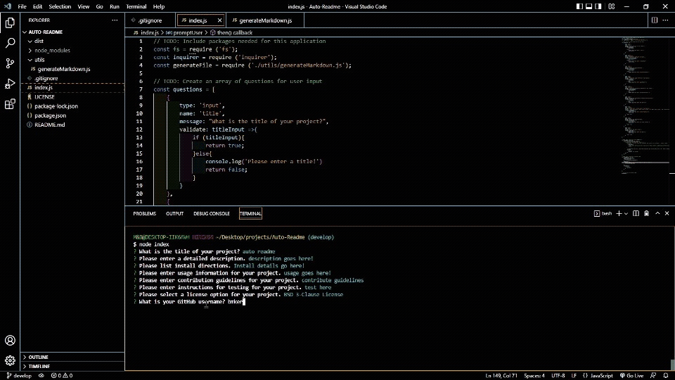

# Auto ReadMe
  
  ## Description
  This is a simple node.js app that takes user input for a professional readme. We make use of current ES6 language. 
  ## Table of Contents
  * [Installation](#installation)
  * [Usage](#usage)
  * [License](#license)
  * [Contribution](#contribution)
  * [Tests](#tests)
  * [Questions](#questions)
  * [ScreenCaps/Vids](#screencaps/vids)
  ## Installation
  Clone the repo to your desired location. Open code editor to the root directory for the project. In your terminal, you will have to type "npm install" to get required packages
  ## Usage
  Once this project have been installed, simply type node index (while in the root directory for the project) and follow prompts
  ## License
  This project is covered under The MIT License.  
  Please visit [https://opensource.org/licenses/MIT](https://opensource.org/licenses/MIT) to learn more.
  
  ## Contribution
  There is currently no need for contributions at this point.
  
  ## Tests 
  To test this project install it and follow prompts to create your own readme!
  
  ## Questions
  If you have any questions about this project please reach out by Email or on GitHub!  
  Email: bmkersey@gmail.com  
  GitHub: [bmkersey](https://github.com/bmkersey)

  ## Screencaps/Vids
   
  
  